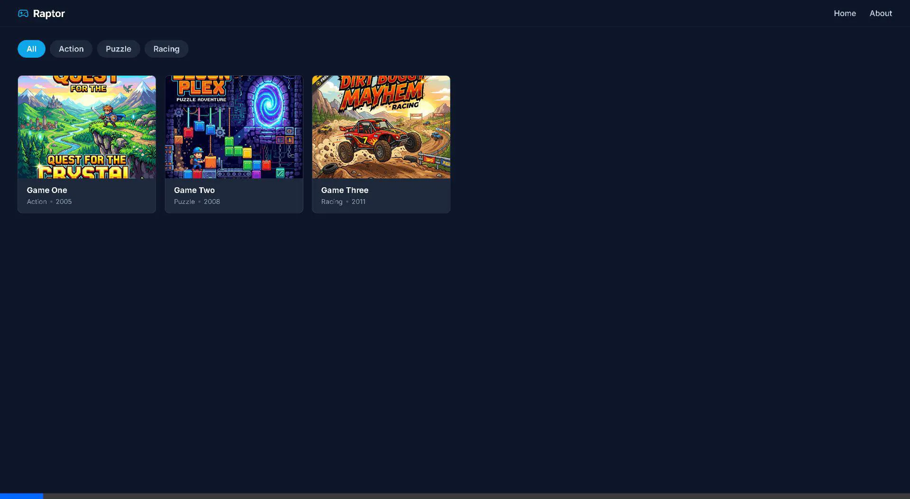
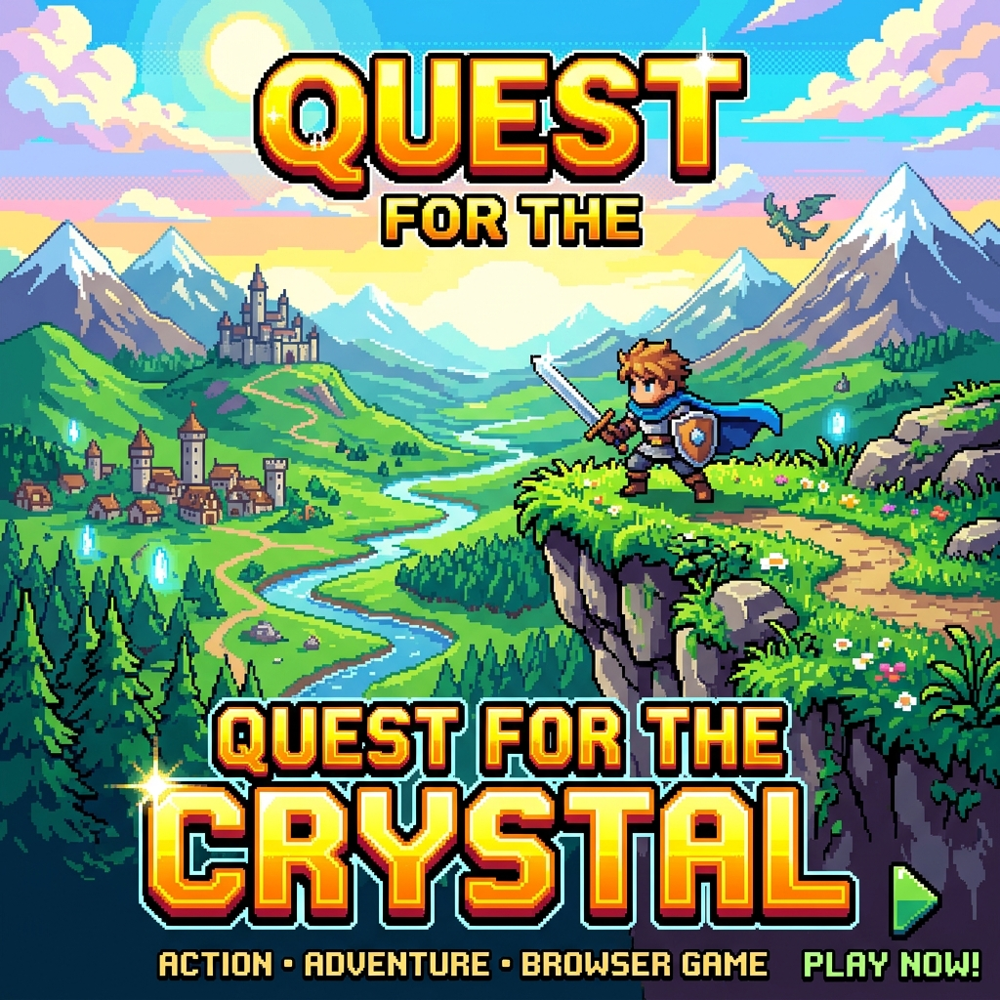
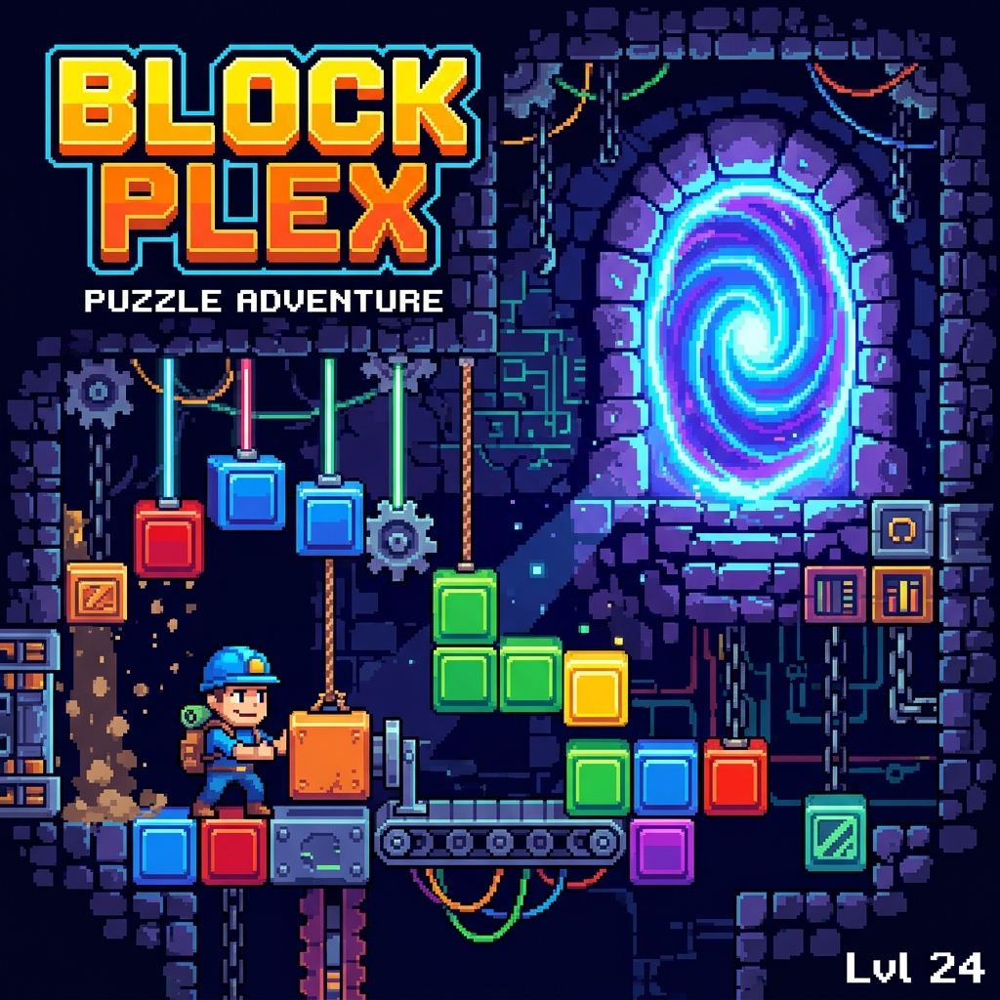
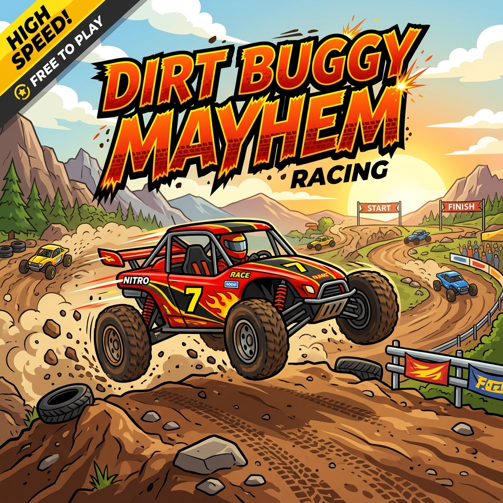

# Raptor Portal



A strictly local, React and Vite-powered browser game portal demo designed for class presentations. The UI mimics classic Flash portal density while utilizing a modern, dark, Friv-inspired layout.

Powered by the [Ruffle](https://ruffle.rs/) WebAssembly emulator.

## Interface Previews
| Action Games | Puzzle Games | Racing Games |
|:---:|:---:|:---:|
|  |  |  |

## Prerequisites
- Node.js 18+
- Ruffle Web Standalone (Local Assets)

## Setup & Installation

**1. Install Dependencies**
```bash
npm install
```

**2. Setup Emulator (Ruffle)**
Because of the standalone, backend-free architecture, Ruffle is expected to be hosted dynamically on the client itself.
1. Download [Ruffle Web Standalone](https://ruffle.rs/#releases).
2. Extract the archive.
3. Place all contents directly into `public/ruffle/` so that the file `public/ruffle/ruffle.js` exists.

**3. Run the Portal**
```bash
npm run dev
```

## Adding Local Games
This project does not pull from a server. It renders precisely what is hardcoded in the single-source-of-truth metadata file.

1. Create a logical directory for your SWF inside `/public/games/`.
   - e.g., `/public/games/my-game/`
2. Place your `.swf` and `.png` or `.jpg` thumbnail inside.
   - e.g., `/public/games/my-game/game.swf`
   - e.g., `/public/games/my-game/thumb.png` (4:3 aspect ratio recommended)
3. Open `src/data/catalog.ts` and append your entry:

```typescript
export const games: Game[] = [
  // ...
  {
    id: 'my-game',
    title: 'My Game Title',
    genre: 'Action',
    year: 2012,
    description: 'A brief description of the gameplay.',
    controls: 'WASD to move.',
    thumbnail: '/games/my-game/thumb.png',
    filePath: '/games/my-game/game.swf',
    relatedSlugs: ['another-game-id'],
  }
]
```

## Emulator Missing Fallback
By default, navigating to a play page before copying the Ruffle binaries into `public/ruffle/` will display a clean, user-friendly fallback tile outlining exactly how to fix the missing emulator dependencies.

## Deployment
```bash
npm run build
```
Upload the `/dist` directory to any static host (GitHub Pages, Netlify, Vercel). No database setup required.
